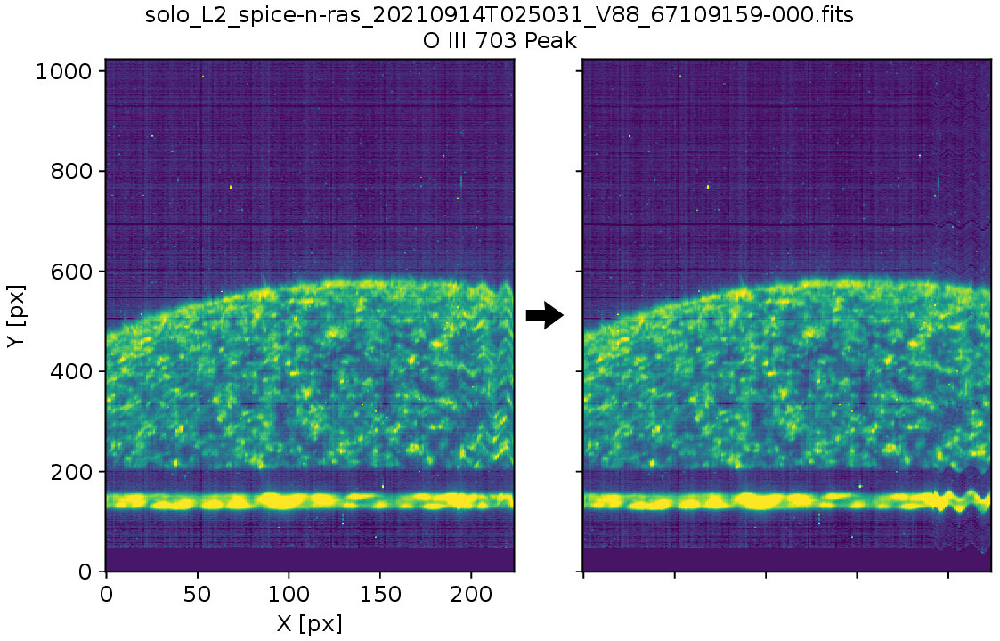

# SPICE jitter correction

Correct the pointing of SolarOrbiter/SPICE for each slit position, using
the AOCS data present in the FITS files.



This tool transforms regular L2 FITS files into ‘L2r’ files, where the pointing
instability is corrected and the data is interpolated onto a regular grid.

Note that for rasters, X-positions no longer correspond to slit positions in
the interpolated L2r files. As a result, the correspondence between X and time
may be lost. This means that intensities at consecutive X-positions could
originate non-consecutive time steps, or event that intensities from different
time steps could be interpolated onto the same X-position.

**Warning:** This tool requires that the L2 FITS contain the pointing at each
slit position (in image extensions named `WCSDVARR`). These data are not yet
present in the FITS files, and will be added in a future release.


## Installation

```
pip install git+https://github.com/gpelouze/spice_jitter_correction.git
```


## Usage


### From the command line

Use the `spice_jitter_correction` command in the terminal, eg:

```
spice_jitter_correction /archive/SOLAR-ORBITER/SPICE/fits/level2/2021/09/14/solo_L2_spice-n-ras_20210914T025031_V06_67109159-000.fits -O ./spice_jitter_correction_test/ --plot-results
```

See `spice_jitter_correction -h` for more options.


### In Python

Use the `spice_jitter_correction.correct_jitter` function, eg:

```
import spice_jitter_correction
spice_jitter_correction.correct_jitter(
    '/archive/SOLAR-ORBITER/SPICE/fits/level2/2021/09/14/solo_L2_spice-n-ras_20210914T025031_V03_67109159-000.fits',
    './spice_jitter_correction_test/',
    plot_results=True,
    )
```


## License

This package is released under a MIT open source licence. See `LICENSE.txt`.